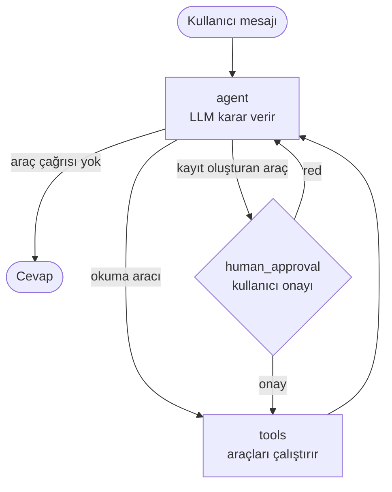

# Bastet: Kurumsal Çalışan Asistanı (AI Agent)

Hayali bir şirketin (Mitogent Teknoloji A.Ş.) çalışanlarına yardım eden, Türkçe konuşan bir yapay zekâ asistanı.

Bastet şirket politikalarını **RAG** ile kaynak göstererek cevaplar, **tool calling** ile çalışan adına işlem yapar (izin bakiyesi sorgulama, izin talebi oluşturma, IT destek talebi açma) ve çok adımlı görevleri **LangGraph** ile kurulmuş bir agent akışında yürütür. Kayıt oluşturan her işlem, çalıştırılmadan önce kodla zorunlu kılınmış bir **kullanıcı onayından** geçer.

OpenAI, Anthropic ve Google Gemini ile çalışır; sağlayıcı tek bir ayarla değiştirilebilir.

**İçindekiler:**
[Örnek konuşma](#örnek-konuşma) ·
[Özellikler](#özellikler) ·
[Kurulum](#kurulum) ·
[Çalıştırma](#çalıştırma) ·
[Testler](#testler) ·
[Mimari](#mimari) ·
[Proje yapısı](#proje-yapısı) ·
[RAG değerlendirmesi](#rag-değerlendirmesi) ·
[Tasarım kararları](#tasarım-kararları-ve-öğrenilenler)

---

## Örnek konuşma

```
Sen: Devreden iznimi ne zamana kadar kullanmam gerekiyor ve kaç gün devreden iznim var?
  [araç] search_company_policies(queries=['devreden izin son kullanma tarihi'])
  [araç] get_leave_balance()
Bastet: Devreden izniniz 2 gündür ve bunu en geç 31 Mart tarihine kadar kullanmanız gerekir.
     Bu tarihe kadar kullanılmayan devreden izinler yanar.
     Kaynak: leave_policy.md > Yıllık İzin Devri

Sen: Gelecek ayın ilk pazartesi ve salı günü yıllık izin almak istiyorum.
  [araç] get_calendar(month='2026-11')
  [araç] create_leave_request(start_date='2026-11-02', end_date='2026-11-03', leave_type='yillik')

  ONAY GEREKİYOR
  - İzin talebi: Yıllık izin, 02.11.2026 Pazartesi - 03.11.2026 Salı (2 iş günü)
  Onaylıyor musunuz? (e/h): e

Bastet: İzin talebiniz oluşturuldu ve onay için yöneticiniz Mehmet Abacı'ya gönderildi.
```

## Özellikler

- **Agentic RAG:** Belge araması bir araçtır; ne zaman arama yapılacağına agent karar verir. Cevaplar kaynak belge ve bölümle birlikte verilir.
- **Multi-query retrieval:** Agent, kullanıcının sorusunu belgelerin diline çeviren 1-3 sorgu üretir; sonuçlar Reciprocal Rank Fusion ile birleştirilir.
- **Tool calling:** Profil, izin bakiyesi, izin talepleri, takvim ve IT destek araçları.
- **Human-in-the-loop:** Kayıt oluşturan araçlar LangGraph `interrupt` ile durdurulur; kullanıcı onaylamadan çalışmaz. Onay özeti LLM'den değil koddan üretilir.
- **Kodda yetkilendirme:** Araçlar çalışan kimliğini parametre olarak almaz, oturumdan alır. LLM başka bir çalışanın verisine erişemez.
- **Kodda iş kuralları:** İzin bakiyesi, en az 5 iş günü önceden bildirim gibi politikalar araçların içinde zorunlu kılınır.
- **Üç arayüz:** Web arayüzü, REST API (FastAPI) ve terminal sohbeti; üçü de aynı agent'ı kullanır.
- **Sağlayıcıdan bağımsız mimari:** OpenAI, Anthropic veya Gemini arasında `.env` üzerinden geçiş.
- **Sürümlenen prompt'lar:** Tüm prompt'lar `prompts/` klasöründe ayrı dosyalarda tutulur ve Git ile izlenir.

---

## Kurulum

Python 3.10 veya üzeri gerekir.

```bash
# 1. Projeyi indir ve sanal ortam kur
git clone https://github.com/KULLANICI_ADIN/corporate_assistant.git
cd corporate_assistant
python3 -m venv .venv
source .venv/bin/activate              # Windows: .venv\Scripts\activate

# 2. Bağımlılıkları kur
pip install -r requirements.txt        # uygulama
pip install -r requirements-dev.txt    # testler için (pytest)

# 3. API anahtarını ayarla
cp .env.example .env                   # .env içine en az bir API anahtarı yaz
python -m scripts.test_connection      # LLM bağlantısını test et

# 4. Verileri hazırla
python -m scripts.build_index          # Belgeleri indeksle (ilk seferde embedding modeli indirilir)
python -m scripts.init_db              # Örnek çalışan veritabanını oluştur
```

`.env` içindeki `LLM_PROVIDER` ayarı hangi sağlayıcının kullanılacağını belirler (`anthropic`, `openai` veya `gemini`).

> Aşağıdaki komutların hepsi proje klasöründe ve sanal ortam aktifken (`source .venv/bin/activate`) çalıştırılır.

---

## Çalıştırma

### Web arayüzü

```bash
uvicorn src.api:app --reload
```

Tarayıcıda **http://127.0.0.1:8000** adresini açın ve listeden bir çalışan seçin. Sol panelde izin bakiyesi ve son talepler, sağda sohbet bulunur. Kayıt oluşturan işlemler için bir onay kartı çıkar.

### Terminal sohbeti

```bash
python -m scripts.chat                 # Muhammet Boğa (E001) olarak
python -m scripts.chat --user E004     # Farklı bir çalışan olarak
```

| Komut | Ne yapar |
|---|---|
| `/sifirla` | Yeni konuşma başlatır |
| `/debug` | Araç sonuçlarını gösterir / gizler |
| `/cikis` | Sohbetten çıkar |

### REST API

```bash
uvicorn src.api:app --reload
```

Swagger arayüzü: **http://127.0.0.1:8000/docs**. Sağ üstteki **Authorize** butonuna bir demo token'ı yazın (ör. `demo-token-e001`).

| Endpoint | Açıklama |
|---|---|
| `POST /chat` | Mesaj gönderir; onay gereken işlemlerde `approval_required` döner |
| `POST /chat/{thread_id}/approval` | Bekleyen işlemi onaylar veya reddeder |
| `GET /me` | Token'a göre oturum açmış çalışan |
| `GET /me/dashboard` | Profil, izin bakiyesi ve son talepler (web arayüzünün sol paneli) |
| `GET /health` | Servis durumu |

Örnek istek:

```bash
curl -X POST http://127.0.0.1:8000/chat \
  -H "Authorization: Bearer demo-token-e001" \
  -H "Content-Type: application/json" \
  -d '{"message": "Kaç gün iznim kaldı?"}'
```

Kimlik istek gövdesinden değil token'dan alınır; kullanıcılar yalnızca kendi konuşmalarına erişebilir. Loglar JSON formatındadır ve mesaj içerikleri gizlilik nedeniyle loglanmaz.

### Docker

```bash
docker compose up --build
```

İmaj oluşturulurken belgeler indekslenir ve örnek veritabanı kurulur; konteyner açılınca web arayüzü ve API **http://127.0.0.1:8000** adresinde hazırdır. API anahtarları `.env` dosyasından okunur.

### Demo çalışanlar

| ID | Çalışan | Unvan | Durum | Token |
|---|---|---|---|---|
| E001 | Muhammet Boğa | Yazılım Geliştirici | 3 yıllık kıdem, 14 gün kalan izin | `demo-token-e001` |
| E002 | Beste Tokpınar Boğa | İK Müdürü | Yönetici | `demo-token-e002` |
| E003 | Dilan Metin İşler | Kıdemli Yazılım Geliştirici | 7 yıllık kıdem | `demo-token-e003` |
| E004 | Lila Tokpınar | İK Uzmanı | 1 yılını doldurmamış, izin hakkı yok | `demo-token-e004` |
| E005 | Mehmet Abacı | Yazılım Müdürü | Yönetici | `demo-token-e005` |
| E006 | Limon Tokpınar | UI/UX Tasarımcısı | 4 yıllık kıdem, 11 gün kalan izin | `demo-token-e006` |

Veritabanını ilk haline döndürmek için: `python -m scripts.init_db` (oluşturulan tüm talepler silinir).

### Yardımcı script'ler

| Komut | Ne yapar |
|---|---|
| `python -m scripts.test_connection` | `.env`'de anahtarı olan her sağlayıcıya kısa bir test mesajı gönderir |
| `python -m scripts.build_index` | Belgeleri parçalayıp vektör veritabanına kaydeder |
| `python -m scripts.build_index --chunk-size 400 --overlap 50` | Farklı parça boyutuyla indeksler |
| `python -m scripts.init_db` | Örnek çalışan veritabanını oluşturur (varsa sıfırlar) |
| `python -m scripts.ask "Masraf fişlerini ne zamana kadar teslim etmeliyim?"` | Tek bir soru sorar; bulunan parçaları ve cevabı gösterir |
| `python -m scripts.eval_retrieval` | Arama kalitesini ölçer (LLM kullanmaz, ücretsiz) |
| `python -m scripts.eval_retrieval --rewrite` | Aynı ölçüm, sorgu yeniden yazma ile (LLM kullanır) |
| `python -m scripts.prompt_lab` | Prompt deneyleri: system prompt etkisi ve niyet sınıflandırma |
| `python -m scripts.draw_graph` | Agent grafının Mermaid diyagramını üretir |

---

## Testler

Testler üç gruba ayrılır. Varsayılan `pytest` komutu yalnızca hızlı testleri çalıştırır.

| Komut | Ne çalışır | Gereksinim |
|---|---|---|
| `pytest` | Hızlı testler: araçlar, iş kuralları, agent grafı, onay akışı, API | Hiçbir şey; sahte LLM kullanılır, ücretsizdir |
| `pytest -m slow` | Arama kalitesi testi | Embedding modeli ve indeks (`scripts.build_index`) |
| `pytest -m llm` | Gerçek LLM ile davranış testleri | `.env`'de API anahtarı; **ücretlidir** |
| `pytest -m ""` | Hepsi | Yukarıdakilerin hepsi |

Sık kullanılan seçenekler:

```bash
pytest -v                                        # Her testin adını göster
pytest tests/test_tools.py                       # Tek bir dosya
pytest tests/test_api.py::test_simple_chat       # Tek bir test
pytest -k approval                               # Adında "approval" geçen testler
pytest -x                                        # İlk hatada dur
```

| Dosya | Neyi test eder |
|---|---|
| `tests/test_tools.py` | Araçlar ve iş kuralları (bakiye, bildirim süresi, yetki) |
| `tests/test_graph.py` | Agent grafı: onay bekleme, onay/red, konuşma hafızası |
| `tests/test_service.py` | Ortak graf çalıştırma mantığı (`src/service.py`) |
| `tests/test_api.py` | REST API: kimlik doğrulama, yetkilendirme, onay akışı, dashboard |
| `tests/test_prompts.py` | Prompt dosyalarının yüklenmesi |
| `tests/test_retrieval.py` | Arama isabet oranı (`slow`) |
| `tests/test_llm_behavior.py` | Uydurmama, takvim kullanımı, kaynak gösterme, veri gizliliği (`llm`) |

LLM gerektiren davranışlar hızlı testlerde `tests/conftest.py` içindeki `FakeLLM` ile taklit edilir. Her push ve pull request'te GitHub Actions hızlı testleri otomatik çalıştırır (`.github/workflows/tests.yml`).

---

## Mimari



| Bileşen | Teknoloji |
|---|---|
| Agent akışı | LangGraph (StateGraph, interrupt, checkpointer) |
| LLM | Anthropic Claude Haiku 4.5 (varsayılan), OpenAI, Gemini |
| Embedding | `intfloat/multilingual-e5-base` (yerel, ücretsiz) |
| Vektör veritabanı | ChromaDB |
| Çalışan verisi | SQLite |
| API | FastAPI |
| Web arayüzü | Tek dosya HTML + JavaScript (framework yok) |

## Proje yapısı

```
corporate_assistant/
├── data/policies/         # Şirket politika belgeleri (Markdown)
├── prompts/               # Sürümlenen prompt dosyaları
├── web/index.html         # Web arayüzü
├── src/
│   ├── api.py             # FastAPI servisi ve web arayüzünün sunulması
│   ├── auth.py            # Token ile kimlik doğrulama
│   ├── service.py         # Grafı çalıştırma (API ve terminal ortak kullanır)
│   ├── graph.py           # LangGraph agent akışı
│   ├── tools.py           # Agent araçları ve iş kuralları
│   ├── rag.py             # Parçalama, indeksleme, arama, multi-query
│   ├── dashboard.py       # Web arayüzünün sol paneli için özet bilgiler
│   ├── database.py        # SQLite çalışan veritabanı
│   ├── llm.py             # Sağlayıcıdan bağımsız LLM erişimi
│   ├── embeddings.py      # Yerel embedding modeli
│   ├── prompts.py         # Prompt dosyalarını yükler
│   ├── logging_config.py  # JSON loglama
│   └── agent.py           # İlk sürüm: elle yazılmış tool calling döngüsü
├── scripts/               # Komut satırı araçları (bkz. Yardımcı script'ler)
├── tests/                 # pytest testleri
├── Dockerfile
└── docker-compose.yml
```

---

## RAG değerlendirmesi

12 test sorusunda doğru belge bölümünün ilk 3 sonuç içinde bulunma oranı. Ölçüm LLM kullanmaz, tekrar üretmek için: `python -m scripts.eval_retrieval`

| Embedding modeli | Parça boyutu | Sorgu yeniden yazma | İsabet |
|---|---|---|---|
| multilingual-e5-small | 200 | Yok | %92 |
| multilingual-e5-small | 800 | Yok | %83 |
| multilingual-e5-small | 1500 | Yok | %83 |
| multilingual-e5-base | 400 | Yok | %92 |
| multilingual-e5-base | 800 | Yok | %92 |
| **multilingual-e5-base** | **800** | **Var** | **%100** |

**Bulgular**

- Belgeler önce başlıklara göre bölündüğü için 800 ve 1500 aynı parçaları üretti; yapıya göre bölmede parça boyutu daha az kritik hale geliyor.
- Küçük modelde yüksek isabet için parçaları 200 karaktere indirmek gerekti; bu da içeriksiz başlık parçalarına ve bağlamı kopuk listelere yol açtı. Büyük model, bölümleri bütün tutarken aynı isabete ulaştı.
- Doğrudan aramada kaçan tek soru ("Udemy kursu almak istiyorum...") belgede geçmeyen bir marka adı içeriyordu. Hata embedding modelinde değil sorgunun ifadesindeydi; sorgu yeniden yazma ile çözüldü.
- **Test sızıntısı düzeltmesi:** İlk sürümde sorgu yeniden yazma prompt'undaki örnek, test sorusunun cevabını ("Udemy" → "online kurs") içeriyordu. Ölçümün adil olması için örnek, testte bulunmayan bir markayla değiştirildi ve ölçüm tekrarlandı.

## Tasarım kararları ve öğrenilenler

**LLM'in zayıf olduğu işi koda bırakmak.** İlk sürümde Bastet "gelecek ayın ilk pazartesi" ifadesini yanlış hesapladı ve talebi yanlış günlere oluşturdu; ardından "yarın" için yanlış ayı söyledi. Prompt'u sertleştirmek yerine bir `get_calendar` aracı eklendi; onay ekranındaki tarih ve gün adları da LLM'den değil koddan üretiliyor.

**Onayı prompt'tan koda taşımak.** Aşama 3'te onay adımı sadece system prompt'taki bir kurala bağlıydı. LangGraph'a geçişle birlikte kayıt oluşturan araçlar `interrupt` ile durduruluyor; LLM kurala uymasa bile işlem onaysız çalışamıyor.

**Halüsinasyonu kural netleştirerek azaltmak.** İlk prompt sürümünde Bastet izin günü uydurmadı ama var olmayan bir "çalışan portalı" önerdi. Yönlendirme kanallarını açıkça sınırlayan bir kural eklenerek giderildi.

**Araçlar sebep de döndürmeli.** İzin hakkı 0 olan bir çalışan için araç sadece "0 gün" döndürdüğünde Bastet sebebini tahmin etmeye çalıştı. Araç artık sayının sebebini de (kıdem süresi) döndürüyor.

**Kişisel veri her seferinde kaynaktan okunmalı.** Bastet bir noktada kalan izni önceki cevaptaki sayıdan hesapladı. Prompt, kişisel verilerin her soruda araçla yeniden sorgulanmasını zorunlu kılacak şekilde güncellendi.

## AI destekli geliştirme

Bu projede Claude Code'u testlerle denetlenen bir geliştirme ortağı olarak kullandım.
`CLAUDE.md` dosyası, AI asistanına projenin mimarisini ve asla bozulmaması gereken
kuralları (kimliğin oturumdan gelmesi, iş kurallarının kodda olması vb.) anlatır.

- **Refactoring:** `chat.py` ve `api.py` içinde tekrarlanan graf çalıştırma mantığını
  `src/service.py` modülüne taşıttım. Değişiklikten önce ve sonra 32 test çalıştırarak
  davranışın korunduğunu doğruladım.
- **Test yazımı:** Yeni modül için testleri AI'a yazdırıp inceledim; [burada AI'ın
  gözden kaçırdığı veya senin düzelttiğin bir şeyi yaz].
- **Ne öğrendim:** [Örneğin: AI'ın önerdiği kodu kabul etmeden önce testlerin
  geçmesini şart koşmak, yanlış bir değişikliği fark etmemi sağladı.]

## Teknolojiler

Python, LangChain, LangGraph, FastAPI, ChromaDB, sentence-transformers, SQLite, Pydantic, pytest, Docker, GitHub Actions
